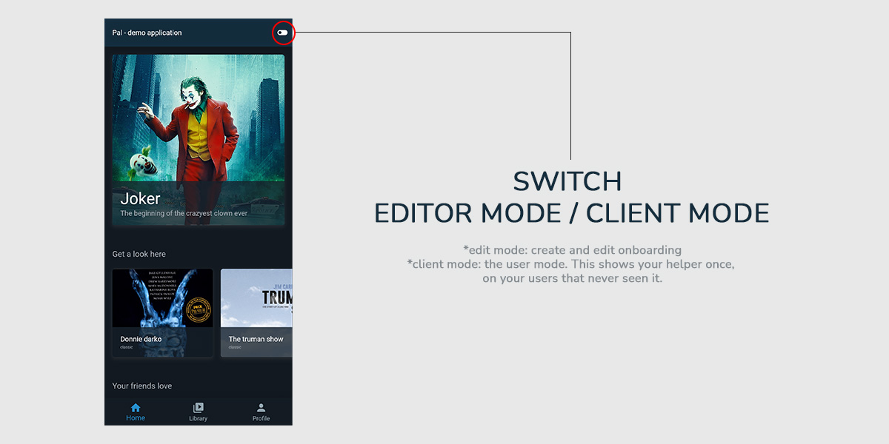

# Pal - Demo app 
Demo application using Pal plugin. 
**A flutter plugin to create a better experience for your users.**

Creates onboarding where you want on your app without code.  

## [Test our demo here using flutter web](https://g-apparence.github.io/#/)

> *This demo has been made for mobile, for better look and feel open it as a mobile view*  
> **Chrome** 
> *In Windows/Linux, press Ctrl+Shift+I or just F12* 
> *In macOS, press option+command+I* 

Works on Android / iOS / Web / Macos / Windows. (Well flutter is magic)

## Wants to know more?
- [Pal plugin on pub.dev](https://pub.dev/packages/pal)
- [Pal official website](https://pal-plugin.tech)
- [Pal documentation](http://doc.pal-plugin.tech)

## Any question? 
Contact us on [our twitter](https://twitter.com/PalFlutter) or email gautier[@@]pal-plugin.tech